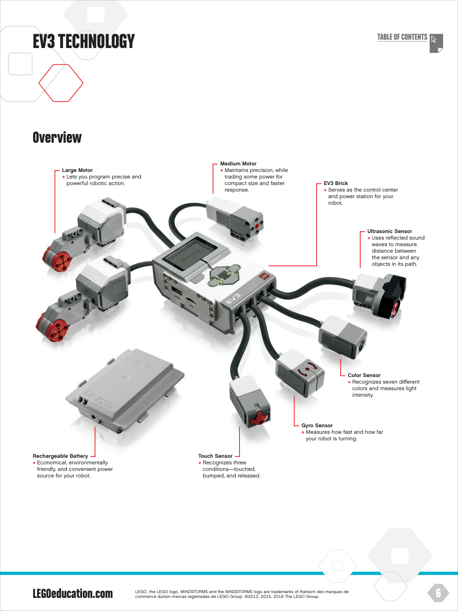
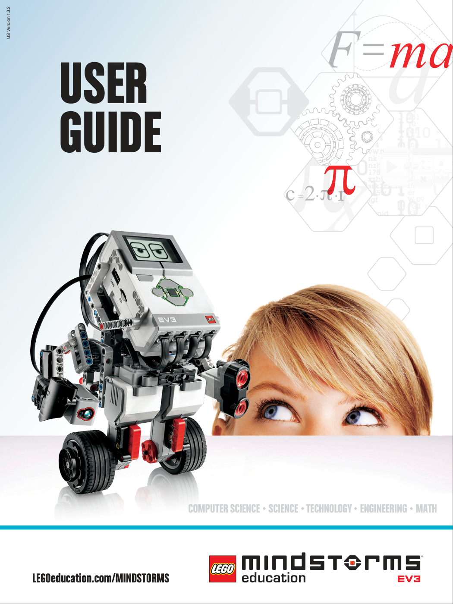
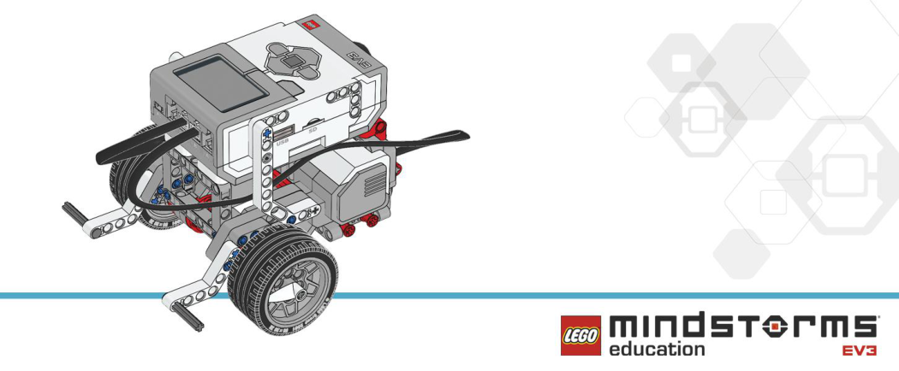
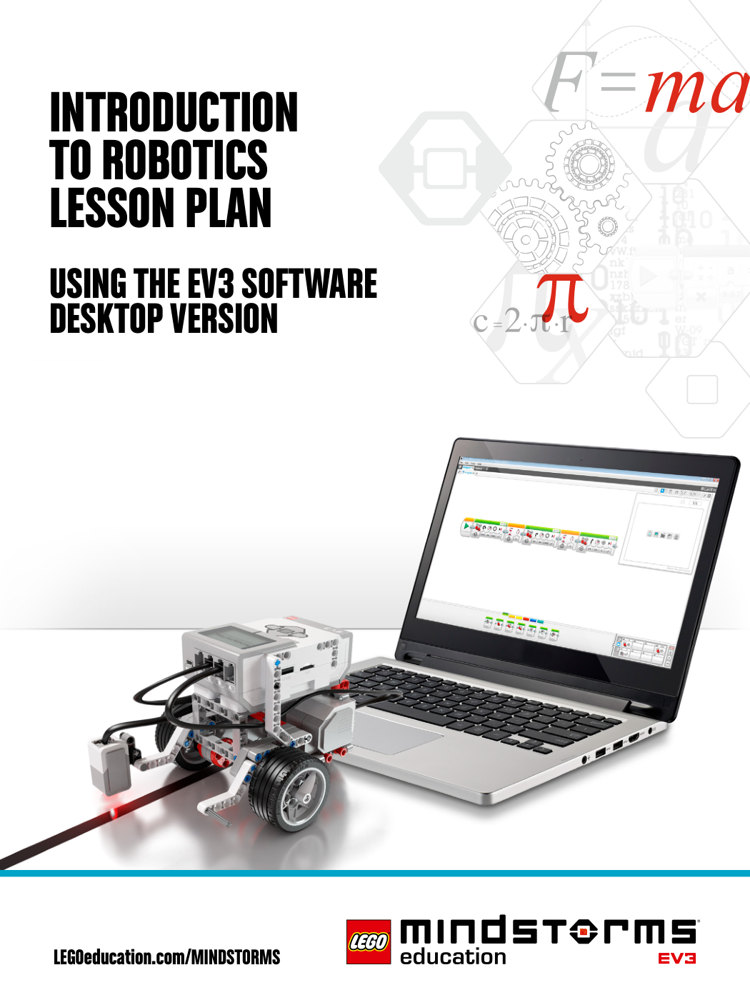
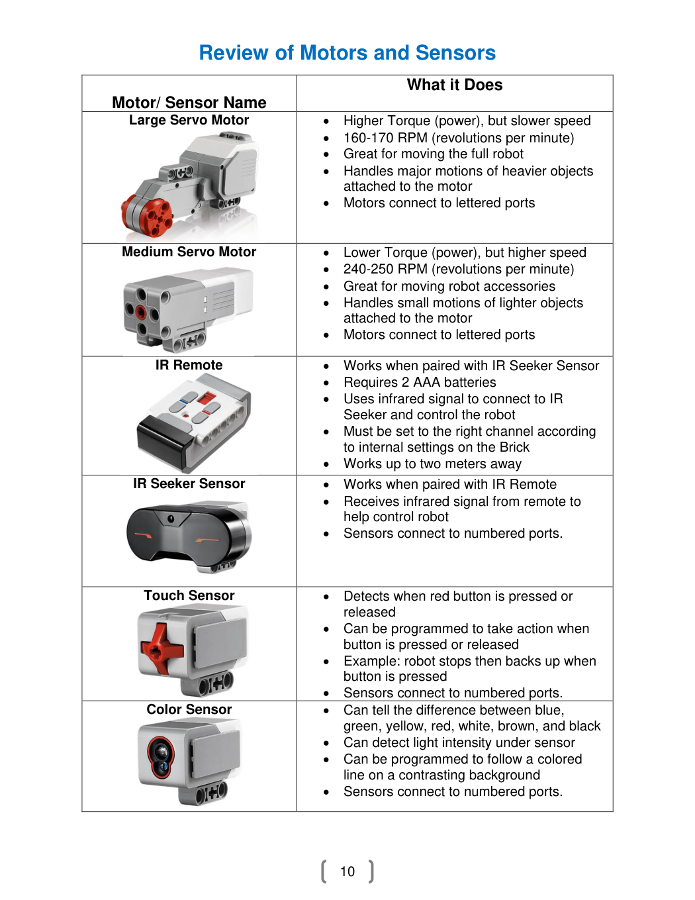
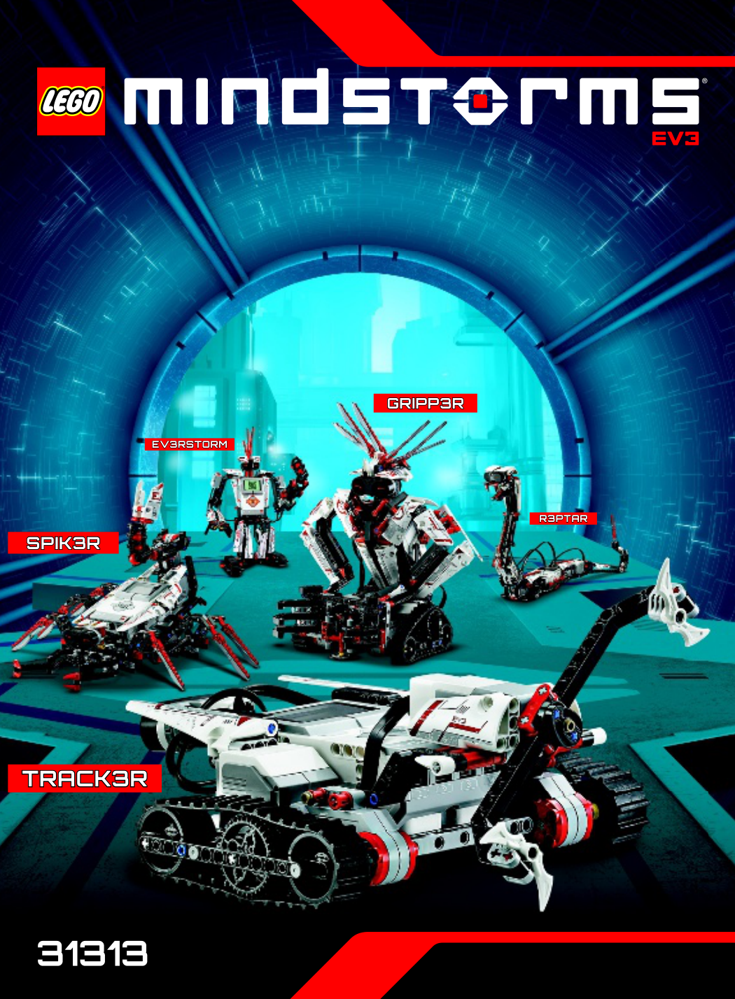

# LEGO MINDSTORMS EV3 Student Hub

> **Student navigation hub for LEGO MINDSTORMS EV3 / Education Core Set 45544**
>
> Build carefully. Understand what each part does. Modify with a purpose. Test. Debug. Explain what you learned.

This repository is a **student-friendly static resource page** for the HSC LEGO Robotics course.  
Use it to find official LEGO EV3 documentation, Robot Educator building instructions, lesson-plan references,
legacy EV3 builds, and open-source EV3 resources.

**Course learning progression:**  
**Follow → Understand → Modify → Solve → Explain → Reflect**

---

## 🚦 Start Here

| I want to... | Go here |
|---|---|
| Learn what the EV3 Brick, motors, sensors, and ports do | [EV3 User Guide](#1-lego-ev3-user-guide) |
| Build our classroom Robot Educator / Driving Base | [Robot Educator Build Instructions](#2-lego-ev3-robot-educator-build-instructions) |
| Learn the official robotics lesson sequence | [Robotics Lesson Plans](#3-lego-ev3-robotics-plan--learning-guides) |
| Build an older EV3 robot or explore another design | [Legacy & Open-Source Builds](#4-open-source--legacy-ev3-builds) |
| Find LEGO's complete EV3 instruction library | [Official LEGO EV3 Building Instructions](https://education.lego.com/en-gb/product-resources/mindstorms-ev3/downloads/building-instructions/) |
| Find the LEGO EV3 support / learning area | [LEGO Education EV3 Resources](https://education.lego.com/en-gb/product-resources/mindstorms-ev3/) |

---

## 🤖 What is LEGO MINDSTORMS EV3?

LEGO MINDSTORMS Education EV3 combines LEGO Technic building elements with a programmable
**EV3 Intelligent Brick**, motors, and sensors. In our class, the goal is not only to copy a build.
We use a reference design to learn **how a robotic system works**, then test, modify, and solve new problems.

<p align="center">
  
</p>

### Core EV3 system

- **EV3 Brick** — the robot's programmable control center.
- **Output ports A–D** — normally used for motors.
- **Input ports 1–4** — normally used for sensors.
- **Large Motor** — strong motor commonly used for driving.
- **Medium Motor** — faster, more compact motor useful for mechanisms and attachments.
- **Color Sensor** — detects color and reflected light.
- **Gyro Sensor** — measures rotation / turning.
- **Touch Sensor** — detects pressed, bumped, or released states.
- **Ultrasonic Sensor** — measures distance using reflected sound.

---

# 1. LEGO EV3 User Guide

<p align="center">
  <a href="resources/01_user_guide/LEGO_EV3_User_Guide_US.pdf">
    
  </a>
</p>

### 📥 Download

**[LEGO MINDSTORMS Education EV3 User Guide — US PDF](resources/01_user_guide/LEGO_EV3_User_Guide_US.pdf)**

### Use this guide when you need to...

- identify the EV3 Brick buttons and ports;
- understand motors and sensors;
- connect the Brick to a computer;
- troubleshoot firmware or connection problems;
- understand the EV3 programming environment;
- look up the Core Set element list.

### Good pages to bookmark

- EV3 technology overview
- EV3 Brick controls and ports
- Large and Medium motors
- Color, Gyro, Touch, and Ultrasonic sensors
- Connecting sensors and motors
- Connecting the EV3 Brick to a computer
- Robot Educator
- Troubleshooting

**Official LEGO page:**  
https://education.lego.com/en-gb/product-resources/mindstorms-ev3/downloads/user-guide/

---

# 2. LEGO EV3 Robot Educator Build Instructions

<p align="center">
  <a href="resources/02_robot_educator/LEGO_EV3_Robot_Educator_Build_Instructions.pdf">
    
  </a>
</p>

### 📥 Download our classroom build

**[Robot Educator / 45544 Build Instructions PDF](resources/02_robot_educator/LEGO_EV3_Robot_Educator_Build_Instructions.pdf)**

This is the main guided build section for students learning to follow technical instructions accurately.

## Official LEGO Robot Educator downloads

LEGO's current EV3 support page includes these Robot Educator models:

- **Driving Base**
- **Color Sensor Down**
- **Color Sensor Forward**
- **Cuboid**
- **Gyro Sensor**
- **Medium Motor Driving Base**
- **Touch Sensor Driving Base**
- **Ultrasonic Sensor Driving Base**

➡️ **[Open the complete official LEGO Robot Educator instruction library](https://education.lego.com/en-gb/product-resources/mindstorms-ev3/downloads/building-instructions/)**

### Classroom build habits

Before you ask for help:

1. Find the build step where your robot last matched the picture.
2. Check the exact part — especially beam length, axle length, and connector type.
3. Check **orientation**: left/right, front/back, and which holes are used.
4. Compare both sides of a symmetrical build.
5. Never force a Technic piece that should fit easily.
6. Ask your teammate what they observe before rebuilding.
7. Make the smallest correction possible, then continue.

> **Accuracy before speed.**  
> A correct robot at Step 40 is more useful than a robot at Step 80 with several hidden mistakes.

---

# 3. LEGO EV3 Robotics Plan & Learning Guides

<p align="center">
  <a href="resources/03_robotics_plan/LEGO_EV3_Introduction_to_Robotics_Lesson_Plan.pdf">
    
  </a>
</p>

### 📥 Downloads

**[LEGO Education — Introduction to Robotics Lesson Plan](resources/03_robotics_plan/LEGO_EV3_Introduction_to_Robotics_Lesson_Plan.pdf)**  
Official classroom sequence covering building/setup, movement, sensors, switches, challenges, and assessment.

**[EV3 Learning & Programming Guide](resources/03_robotics_plan/EV3_Learning_and_Programming_Guide.pdf)**  
A practical guide to kit setup, computer connection, motors/sensors, programming, testing, and troubleshooting.

<p align="center">
  
</p>

## Official LEGO lesson sequence

The LEGO **Introduction to Robotics** plan includes:

1. **Building and Setup**
2. **Curved Move**
3. **Move Object**
4. **Stop at Object**
5. **Stop at Angle**
6. **Stop at Line**
7. **Switch**
8. **Master Challenge — Turntable**
9. **Master Challenge — LEGO Factory Robot**
10. Open-ended Design Brief Challenges

### Useful official LEGO curriculum links

- **EV3 Getting Started:**  
  https://www.education.lego.com/en-gb/start/mindstorms-ev3/
- **Retired EV3 Curriculum Archive:**  
  https://education.lego.com/en-gb/downloads/retiredproducts/mindstorms-ev3/curriculum/
- **EV3 Building Instructions:**  
  https://education.lego.com/en-gb/product-resources/mindstorms-ev3/downloads/building-instructions/
- **EV3 Design Engineering Projects:**  
  https://education.lego.com/en-gb/product-resources/mindstorms-ev3/downloads/ev3-design-engineering-projects-resources/
- **EV3 Core Set 45544 Element Survey / What's in the Box:**  
  https://education.lego.com/en-us/product-resources/mindstorms-ev3/downloads/whats-in-the-box/

---

# 4. Open-Source & Legacy EV3 Builds

<p align="center">
  <a href="resources/04_legacy_and_open_source/LEGO_EV3_31313_Legacy_Builds.pdf">
    
  </a>
</p>

## 4A. Official legacy EV3 / 31313 builds

### 📥 Download

**[LEGO MINDSTORMS EV3 31313 Legacy Build Manual](resources/04_legacy_and_open_source/LEGO_EV3_31313_Legacy_Builds.pdf)**

The legacy EV3 set featured several memorable robots, including:

- **TRACK3R**
- **GRIPP3R**
- **SPIK3R**
- **R3PTAR**
- **EV3RSTORM**

LEGO still hosts an official building-instructions page for **MINDSTORMS EV3 set #31313**:

➡️ https://www.lego.com/service/building-instructions/31313

### More official LEGO Education builds

The Education EV3 page also includes:

**Core Set models**
- Color Sorter
- Gyro Boy
- Puppy
- Robot Arm

**Expansion Set models**
- Elephant
- Remote Control
- Spinner Factory
- Stair Climber
- Tank Bot
- Znap

**Design Engineering builds**
- Grabbers
- Gear mechanisms
- Plot Bot
- Sorter Bot
- Speed Bot
- Turtle
- Turntable
- sensor modules
- and many more

➡️ **[Browse all official EV3 Building Instructions](https://education.lego.com/en-gb/product-resources/mindstorms-ev3/downloads/building-instructions/)**

---

## 4B. Open-source EV3 resources

These are **third-party resources**, not HSC or LEGO-approved curriculum. Use them for exploration,
advanced projects, and inspiration after you understand the standard EV3 system.

### ev3dev — Linux for the EV3 Brick

**Project:** https://github.com/LEGO-Robotics/EV3Dev

EV3 hardware runs a Linux-based system, and the community **ev3dev** project lets advanced users
program compatible LEGO robotics hardware with a wider range of programming languages and tools.

**Good for:** advanced students, Linux/Python exploration, understanding how robotics platforms work below the visual-programming layer.

### Apress — Beginning LEGO MINDSTORMS EV3 source files

**Repository:** https://github.com/Apress/beg-lego-mindstorms-ev3

Companion source files for *Beginning LEGO MINDSTORMS EV3*. It includes example project files
associated with robot-arm and walking-robot chapters.

### Community / university example repository

**ASU Engineering EV3 example:**  
https://github.com/Markay12/mindstormsEV3

Includes EV3 motor, color-sensor, touch-switch, ultrasonic, and autonomous-control examples.

> **Open-source rule:** Always read a repository's license before copying code, instructions, images, or files into your own project.

---

## ⚠️ Commercial EV3 Idea Book

The uploaded *LEGO MINDSTORMS EV3 Idea Book: 181 Simple Machines and Clever Contraptions*
by Yoshihito Isogawa is an excellent **instructor/reference resource**, especially for mechanisms,
gears, vehicles, arms, and sensors.

It is a commercial copyrighted No Starch Press book, so this repository **does not include the full PDF**
for public redistribution.

Publisher information:  
https://nostarch.com/releases/EV3%20Idea%20Book.html

---

# 🧭 Student Troubleshooting Path

Before asking an instructor, try this sequence:

1. **Observe** — What exactly happened?
2. **Expected vs. actual** — What did you expect instead?
3. **Power** — Is the EV3 Brick on and sufficiently charged?
4. **Ports** — Are motors on the expected A/B/C/D ports and sensors on 1/2/3/4?
5. **Cables** — Are they fully inserted?
6. **Mechanical check** — Can wheels/gears/mechanisms move freely?
7. **Build check** — Compare the robot to the instruction image.
8. **Program check** — Verify block, port, power, direction, rotations/degrees, and stop behavior.
9. **Small test** — Run only the smallest piece that might be failing.
10. **Teammate check** — Explain the problem out loud to your partner.
11. **Documentation** — Use the User Guide / lesson guide.
12. **Ask for coaching** — Tell the instructor what you already tested.

A useful help request sounds like:

> “We expected both motors to move forward. Motor B moves, but Motor C does not.  
> We checked the cable and port and tested Motor C by itself. It still does not move.”

That is much more useful than:

> “It doesn't work.”

---

# 📝 Engineering Notebook

For most challenges, record only enough to show your thinking.

### Before testing
- What are we trying to make the robot do?
- What do we predict will happen?
- What variable are we changing?

### After testing
- What actually happened?
- What evidence did we observe or measure?
- Was the problem **mechanical, programming, sensor/environment, or procedure**?
- What is our next smallest change?

### Reflection
- What worked?
- What did not?
- What would we do differently next time?
- Can we explain *why* the final solution works?

---

# 🧰 Equipment Stewardship

EV3 is a retired/legacy platform, so the classroom sets are valuable shared engineering equipment.

- Keep motors, sensors, cables, wheels, and specialty Technic pieces with the assigned kit.
- Do not force gears, axles, connectors, USB plugs, or sensor cables.
- Pick up pieces from the floor immediately.
- Report broken or questionable components.
- Return loose parts to the correct tray/bin.
- Leave the workspace ready for the next engineering team.

---

# 🔗 Important LEGO EV3 Links

| Resource | Link |
|---|---|
| LEGO Education EV3 Building Instructions | https://education.lego.com/en-gb/product-resources/mindstorms-ev3/downloads/building-instructions/ |
| LEGO Education EV3 User Guide | https://education.lego.com/en-gb/product-resources/mindstorms-ev3/downloads/user-guide/ |
| LEGO Education EV3 Getting Started | https://www.education.lego.com/en-gb/start/mindstorms-ev3/ |
| LEGO EV3 Curriculum Archive | https://education.lego.com/en-gb/downloads/retiredproducts/mindstorms-ev3/curriculum/ |
| LEGO EV3 Design Engineering Resources | https://education.lego.com/en-gb/product-resources/mindstorms-ev3/downloads/ev3-design-engineering-projects-resources/ |
| LEGO EV3 Core Set 45544 Element Survey | https://education.lego.com/en-us/product-resources/mindstorms-ev3/downloads/whats-in-the-box/ |
| LEGO MINDSTORMS EV3 #31313 Instructions | https://www.lego.com/service/building-instructions/31313 |

---

# For Students: Which Resource Should I Use?

**My robot is not built yet**  
→ Start with [Robot Educator Build Instructions](#2-lego-ev3-robot-educator-build-instructions).

**I don't know what a motor/sensor/port does**  
→ Open the [EV3 User Guide](#1-lego-ev3-user-guide).

**I finished the standard build and want a new challenge**  
→ Visit [Legacy & Open-Source Builds](#4-open-source--legacy-ev3-builds).

**My robot behaves differently from what I expected**  
→ Use the [Student Troubleshooting Path](#-student-troubleshooting-path).

**I want to understand *why* rather than just copy the instructions**  
→ Record a prediction, test one variable, gather evidence, and explain what changed.

---

## Repository structure

```text
lego-ev3-student-hub/
├── README.md
├── assets/
│   ├── ev3-user-guide-cover.png
│   ├── ev3-hardware-overview.png
│   ├── robot-educator-build-preview.png
│   ├── robotics-lesson-plan-cover.png
│   ├── legacy-31313-builds-cover.png
│   └── motors-and-sensors-reference.png
└── resources/
    ├── 01_user_guide/
    │   └── LEGO_EV3_User_Guide_US.pdf
    ├── 02_robot_educator/
    │   └── LEGO_EV3_Robot_Educator_Build_Instructions.pdf
    ├── 03_robotics_plan/
    │   ├── LEGO_EV3_Introduction_to_Robotics_Lesson_Plan.pdf
    │   └── EV3_Learning_and_Programming_Guide.pdf
    └── 04_legacy_and_open_source/
        ├── LEGO_EV3_31313_Legacy_Builds.pdf
        └── COMMERCIAL_REFERENCE_NOTE.md
```

---

## Attribution / status

LEGO®, MINDSTORMS®, and EV3 are trademarks of the LEGO Group.  
This student hub is an independent educational navigation page and is **not affiliated with or endorsed by the LEGO Group**.

Official LEGO resources linked above remain subject to LEGO's terms and copyrights.  
Third-party/open-source resources remain subject to their respective licenses.

---

### Instructor note

This page is designed to support the classroom progression:

**Follow → Understand → Modify → Solve → Explain → Reflect**

The goal is not to complete the most builds. The goal is to learn to build accurately, reason about a system,
test ideas, debug systematically, and become increasingly independent.
